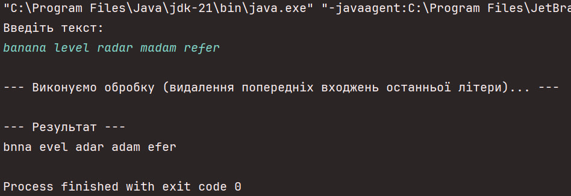
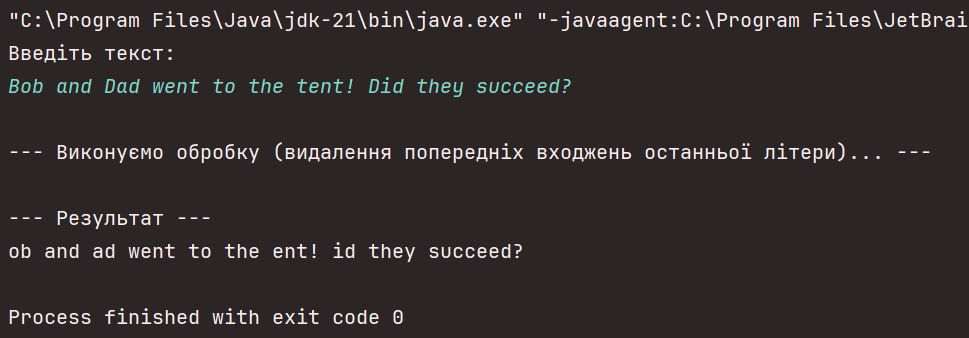
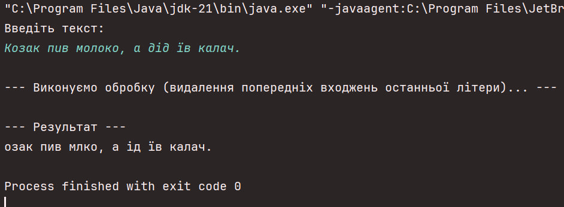

# Лабораторна робота №4
### Тема: Відношення між класами в мові програмування Java.

**Студент:** Слюсар Олександр  
**Група:** ІО-35  
**Номер у списку:** 18  
**Номер залікової книжки:** 3518

---

## Варіант
- **C17 = 3518 mod 17 = 16** → Дія з текстом: **В кожному слові заданого тексту видалити всі попередні входження останньої літери цього слова.**

---

## Завдання
1. Створити програму для обробки тексту, яка використовує об'єктну модель (Composite Pattern).
2. Текст повинен розбиватися на ієрархію об'єктів:
    - **Text** (Текст) — масив речень;
    - **Sentence** (Речення) — масив слів та розділових знаків;
    - **Word** (Слово) — масив літер;
    - **Letter** (Літера) — символ;
    - **Punctuation** (Розділовий знак) — символ.
3. Реалізувати алгоритм варіанту №16: знайти останню літеру слова і видалити всі її попередні входження в цьому ж слові (без урахування регістру).
4. Забезпечити можливість ручного введення тексту з консолі.
5. Код повинен відповідати стандартам **Java Code Conventions**.

---

## Реалізація
- Програма написана на **Java 21**.
- Основний клас: **`Lab4`**.
- Проєкт реалізує повну структуру класів для текстових елементів.

### Структура класів:
1. **`Letter`**: Зберігає символ (`char`). Є найменшою неподільною одиницею.
2. **`Punctuation`**: Зберігає розділовий знак. Дозволяє відокремити пунктуацію від слів при парсингу.
3. **`Word`**:
    - Складається зі списку об'єктів `Letter`.
    - Містить метод `removePreviousOccurrencesOfLastLetter()`, який реалізує основну математику варіанту (прохід з кінця слова до початку).
4. **`Sentence`**:
    - Парсить вхідний рядок на слова та знаки, використовуючи регулярні вирази.
    - Делегує обробку слів об'єктам класу `Word`.
5. **`Text`**:
    - Розбиває великий текст на окремі речення.
    - Запускає процес обробки для всього тексту.
6. **`Lab4`**: Клас із методом `main()`, що забезпечує взаємодію з користувачем через консоль (`Scanner`).

---

## Особливості рішення
- **Регулярні вирази (Regex):** Використовуються складні патерни (`(?=[,.!?:;])|\\s+`) для коректного розділення слів і розділових знаків. Це дозволяє зберегти пунктуацію окремими об'єктами.
- **Ігнорування регістру:** При порівнянні літер використовується `Character.toLowerCase()`, тому 'A' і 'a' вважаються однаковими літерами (що важливо для слів, які починаються з великої літери).
- **Підтримка Unicode:** Програма коректно працює як з англійською, так і з українською мовами.

---

## Приклади виконання

**1. Перевірка алгоритму (класичні приклади)** Вхідні дані: `banana level radar madam refer`  
*Демонструє правильність видалення літер у паліндромних структурах.*

**2. Перевірка регістру та пунктуації** Вхідні дані: `Bob and Dad went to the tent! Did they succeed?`  
*Демонструє, що `Bob` перетворюється на `ob` (B == b), а знак оклику залишається на місці.*

**3. Перевірка української мови** Вхідні дані: `Козак пив молоко, а дід їв калач.`  
*Демонструє роботу з кирилицею.*

